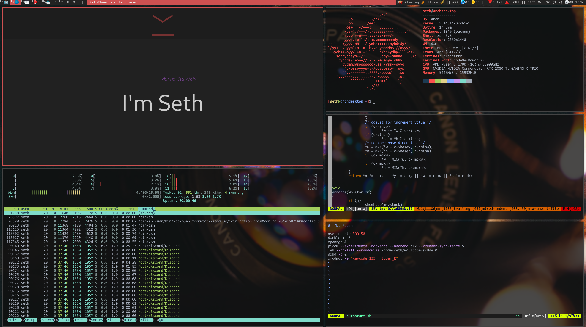
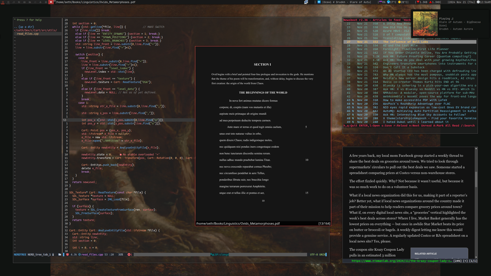

<h3>Github is mid, I do everything from my vps<h3/>

 
 **<a href="https://seththyer.itch.io/" >I have an Itch.io<a/>**
 
 
 
 **<a href="https://seththyer.com/" >All my other links are on my website<a/>**
 

 
  

