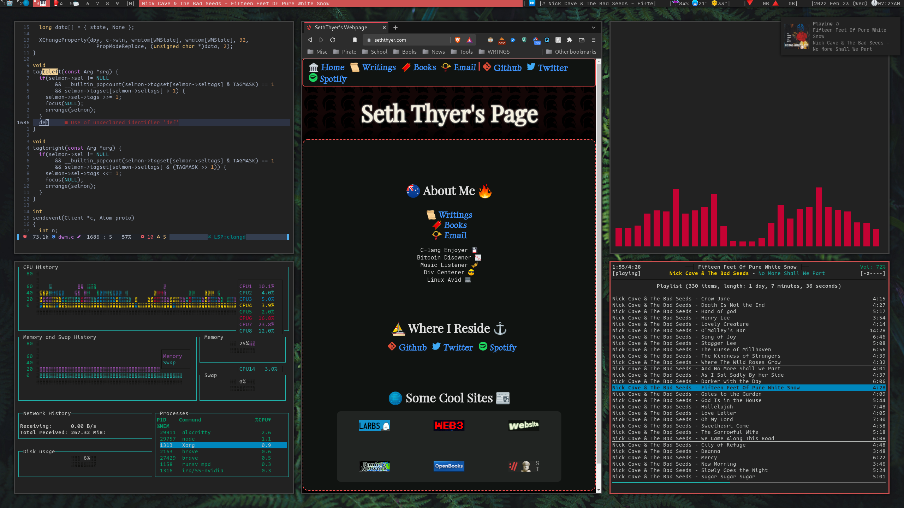
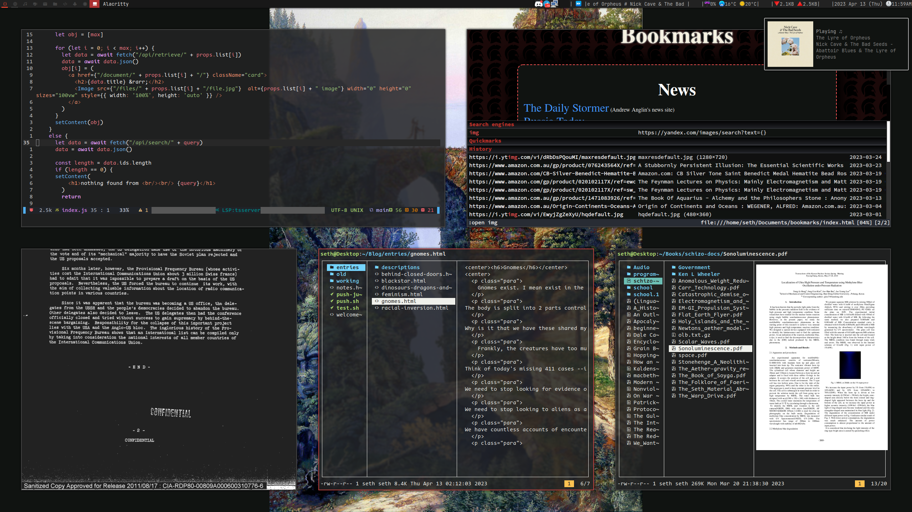

<h3>Github is mid, buy your own server and store files there and locally.<h3/>

 
 **<a href="https://seththyer.itch.io/" >I have an Itch.io<a/>**
 
 
 
 **<a href="https://seththyer.com/" >All my other links are on my website<a/>**
 

 
## The only thing I might maintain here will be my dotfiles
  

 
